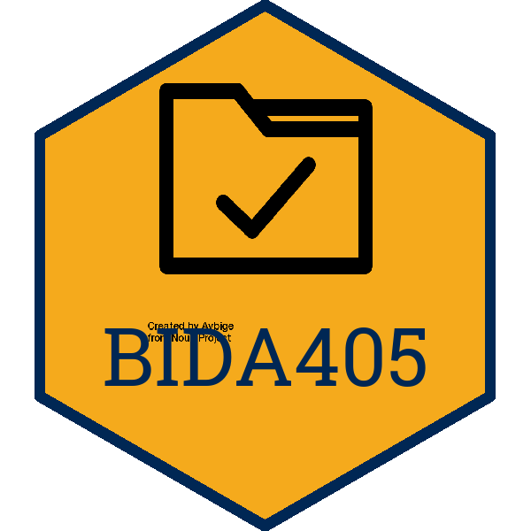

BIDA405 
==========================================================

## UVic Data Analytics Provisioning, Importing, Extracting and Manipulation (BIDA405) course materials

[Data Analytics Provisioning, Importing, Extracting and Manipulation](https://continuingstudies.uvic.ca/business-technology-and-public-relations/courses/data-analytics-provisioning-importing-extracting-and-manipulation) (BIDA405) is offered by the University of Victoria's Continuing Studies, part of the [Business Intelligence and Data Analytics](https://continuingstudies.uvic.ca/business-technology-and-public-relations/series/business-intelligence-and-data-analytics) series.

## Versions:

2020.1.x -- offered 2020, fall (dates TBD) 

