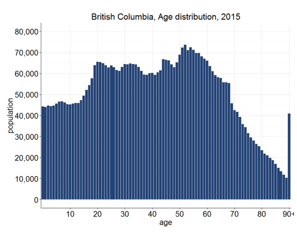

```{r setup, include=FALSE}
options(htmltools.dir.version = FALSE)
```


class: inverse


---
class: inverse

> Cleaning the data is a prerequisite to getting a rock solid understanding of the underlying data.
— Randy Au


---
class: inverse

### 1. Data cleaning is not separate from analysis

--


---
class: inverse

### 2. Data cleaning requires judgment

--
...which in turn requires 

* subject matter knowledge 
* an understanding of the research question

As the questions changes, so might the cleaning you need to undertake.

---
class: inverse

> "Data cleaning" needs to be redefined as "building reusable transformations"
— Randy Au

---
class: inverse


### Goals of data cleaning

1. Fix things that will make your analysis algorithm choke

2. Reduce unwanted variation

3. Eliminate bias (where you can)

???
(from Randy Au, "Data Cleaning IS Analysis, Not Grunt Work")

---
class: inverse


