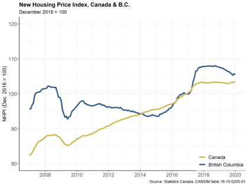

```{r setup, include=FALSE}
options(htmltools.dir.version = FALSE)
```


class: inverse

# Our journey so far...

* Importing data
* Cleaning data


---
class: inverse


## Next: 

## Manipulation of data

---
class: inverse

## Adding new variables

* calculation

* outside sources

  - joins (columns and rows)


---
class: inverse

## Mutating variables

a) calculation

  - combining variables (a + b)
  
  - individual value relative to group

b) merge from other

  - database joins


---
class: inverse

## Calculated variables

Dealing with differences in scale

* standardizing (_z_ score or standard deviations from the mean)

* normalizing (0-1 scale)

* index (set one point = 100)

---

## New Housing Price Index

December 2016 = 100




