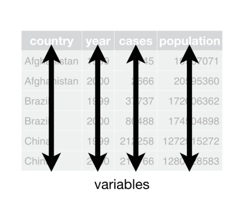
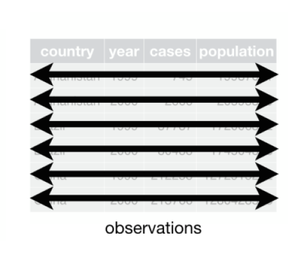
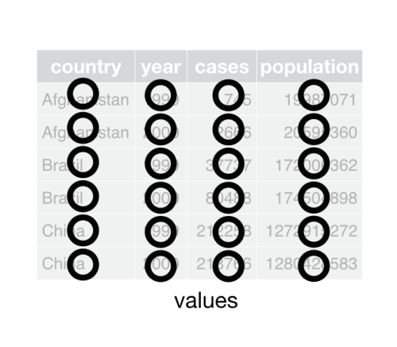
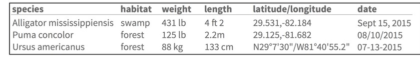
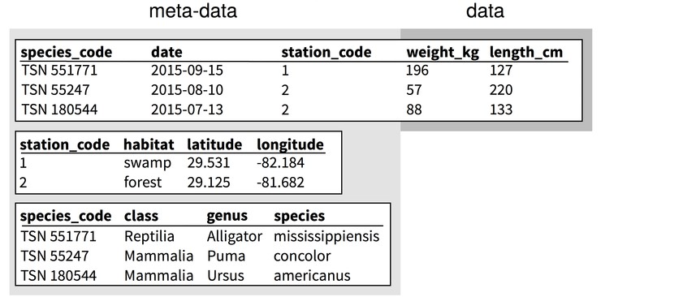

```{r setup, include=FALSE}
options(htmltools.dir.version = FALSE)
```


class: inverse

# Our journey so far...

* Importing data
* Cleaning data
* Data manipulation


---
class: inverse


## Next: 

## Data structures


---

## What makes data tidy? 1/3

* Each variable must have its own column.



---

## What makes data tidy? 1/2

* Each observation must have its own row.


---

## What makes data tidy? 1/3

* Each value must have its own cell.



---
class: inverse

## A tidy example: penguins

```{r echo = FALSE, warning = FALSE}
library(palmerpenguins)
penguins
```

---
class: inverse

## `penguins` characteristics

* every variable is a column

* every observation is a row (the same penguin might be measured in multiple years)

* every cell has a single value 

---
class: inverse

## bonus `penguins` characteristics

* variable names are descriptive

  - including units

* variable names glob 

  - all variables about bills start with "bill_" 


---
class: inverse

## An untidy example





---
class: inverse

A logical step is to go beyond cleaning the data to _restructuring the data_

---
class: inverse

## The same data as relational tables



???

from Hart EM, Barmby P, LeBauer D, Michonneau F, Mount S, Mulrooney P, et al. (2016) Ten Simple Rules for Digital Data Storage. _PLoS Comput Biol_ 12(10): e1005097. https://doi.org/10.1371/journal.pcbi.1005097

---
class:inverse


---
class: inverse

Advantages of relational databases

* _normalization_ - separating the different types of data into their own tables

* reduces redundancy

* easier to maintain (only need to make changes in one place)

